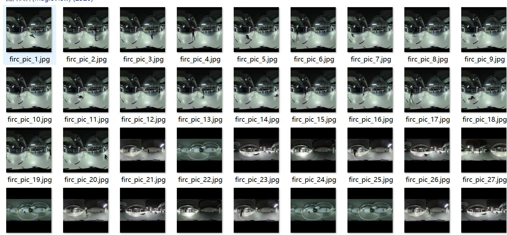
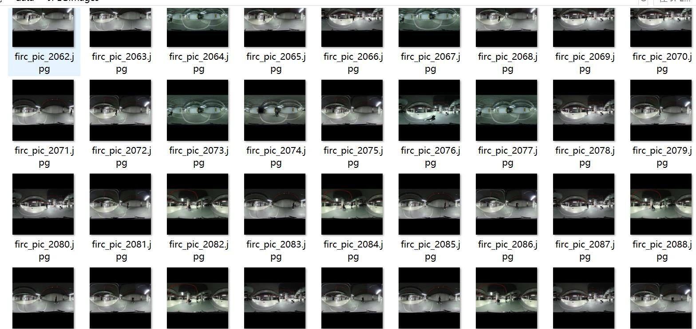
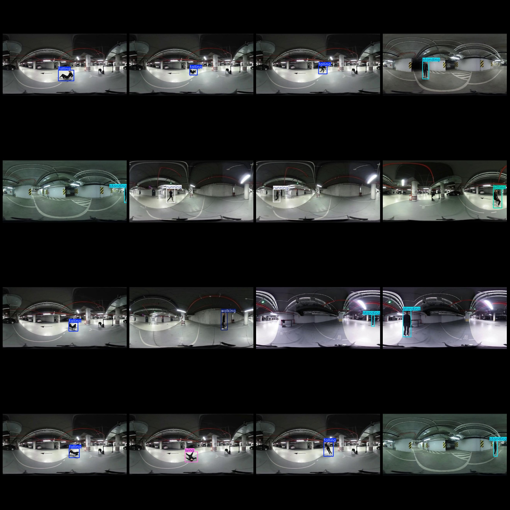
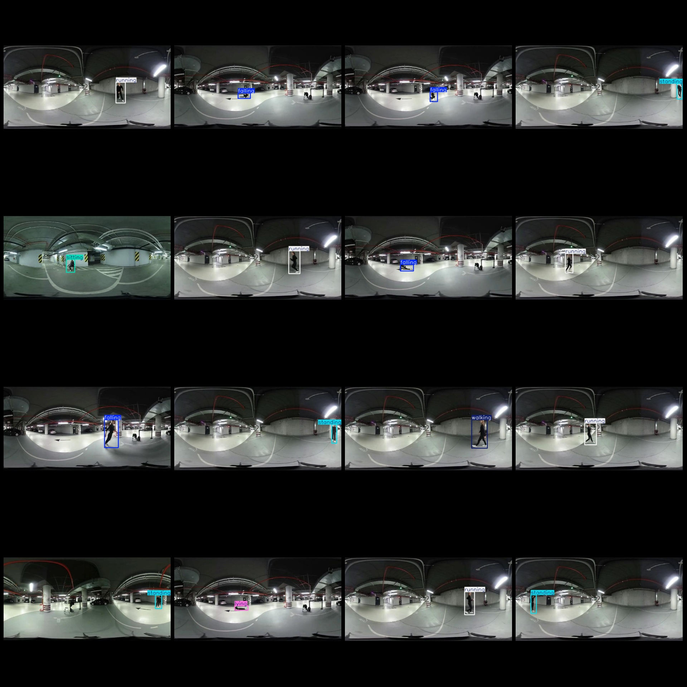

# Human Action and Activity State Detection in Fish Eye Camera View, VOC+YOLO Format, 2520 Images, 6 Categories

Dataset format: Pascal VOC format+YOLO format (without split path in txtfile, only containing jpg image and corresponding VOC format xmlfile and yolo format txtfile)
Number of images (number of jpg files): 2520
annotation count: 2520  
annotation count: 2520  
The number of categories is 6.
The labeled categories are: ["falling", "lying", "running", "sitting", "standing", "walking"]
boxes per class:   
falling box count = 420  
lying box count = 420  
running box count = 420  
sitting box count = 420  
standing box count = 420  
walking box count = 420
total boxes: 2520  
images per class:   
Falling images = 420  
Lying images = 420  
Running images = 420  
Sitting images = 420  
Standing images = 420  
Walking images = 420
Image resolution: 640x640
Use the annotation tool: labelImg.
Annotation Rules: Draw a rectangle around the class.
Important Notes: The dataset must be divided into training, validation, and test sets, which should be done by yourself.
Special Disclaimer: This dataset does not guarantee the accuracy of the trained model or weight files.
Image Preview:
## Images

Here is a pay link on Stripe ( https://buy.stripe.com/3cs8yP7sY87d0vu9AB ). Please contact me lonlonago@foxmail.com after funding $89, and I will send you a complete data files , thank you!

